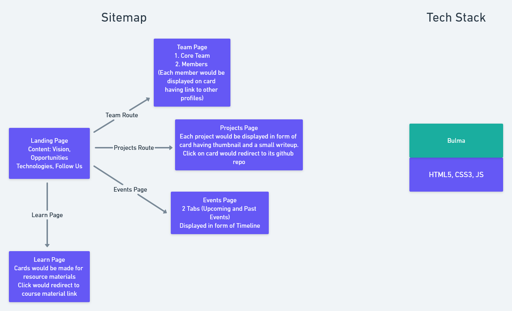

# Elevate Lab Website Development 🌸
<!-- ALL-CONTRIBUTORS-BADGE:START - Do not remove or modify this section -->

<!-- ALL-CONTRIBUTORS-BADGE:END -->

This repository is to make Website to help expand the idea!
The website will contain information regarding all the wonderful people as well as events associated with the same!🌟
Let's learn and make this. 🌞

## _**Link to Github Pages**_
>[Elevate Lab Website](https://elevate-lab.github.io/elevate-lab-website/)

## Welcome to Elevate labs 🚀

> Elevate Labs is here to make a change. We believe in contributing towards the community through technology.
 We also believe in the strength of team! If you too want to be a part of change, we are happy to have you on-board 🥳

 Anyone and everyone is welcomed!:sunglasses:
 
## Workplan and Tech Stack

## Resources to Get started

For a list of resources used by contributors to learn and develop, refer here. [Resources: Getting Started](./Issue_Resource_Template.md)

## How to Contribute

Follow the [Contribution Guidelines](https://github.com/Elevate-Lab/elevate-lab-website/blob/main/How%20To%20Contribute.md) to improve and add to this project.

## Contributors ✨

Thanks goes to these wonderful people 💜 ([emoji key](https://allcontributors.org/docs/en/emoji-key)):

<!-- ALL-CONTRIBUTORS-LIST:START - Do not remove or modify this section -->
<!-- prettier-ignore-start -->
<!-- markdownlint-disable -->
<table>
  <tr>
    <td align="center"><a href="https://github.com/Tlazypanda"> <b>Sneha Mishra</b></a> <a href="#maintenance-Tlazypanda" title="Maintenance">🚧</a></td>
    <td align="center"><a href="https://www.linkedin.com/in/siddhant-khobragade-582a76174/"> <b>Siddhantdrk</b></a> <a href="https://github.com/Elevate-Lab/elevate-lab-website/commits?author=siddhantdrk" title="Code">💻</a></td>
    <td align="center"><a href="https://cybertron-avneesh.github.io/My-Website/"> <b>Avneesh Kumar</b></a> <a href="https://github.com/Elevate-Lab/elevate-lab-website/commits?author=Cybertron-Avneesh" title="Documentation">📖</a></td>
    <td align="center"><a href="https://github.com/deepakDOTexe"> <b>Deepak Katre</b></a> <a href="#maintenance-deepakDOTexe" title="Maintenance">🚧</a> <a href="https://github.com/Elevate-Lab/elevate-lab-website/commits?author=deepakDOTexe" title="Code">💻</a></td>
    <td align="center"><a href="https://github.com/Shreesh90"> <b>Shreesh90</b></a> <a href="https://github.com/Elevate-Lab/elevate-lab-website/commits?author=Shreesh90" title="Documentation">📖</a></td>
    <td align="center"><a href="https://github.com/IC1101Virgo"> <b>Anjali Chaturvedi</b></a> <a href="https://github.com/Elevate-Lab/elevate-lab-website/commits?author=IC1101Virgo" title="Documentation">📖</a></td>
    <td align="center"><a href="https://github.com/cyber-venom003"> <b>cyber-venom003</b></a> <a href="https://github.com/Elevate-Lab/elevate-lab-website/commits?author=cyber-venom003" title="Documentation">📖</a></td>
  </tr>
  <tr>
    <td align="center"><a href="https://www.hiration.com/dieu/personal-website/garvitchittora/"> <b>garvitchittora</b></a> <a href="https://github.com/Elevate-Lab/elevate-lab-website/commits?author=garvitchittora" title="Code">💻</a></td>
    <td align="center"><a href="https://github.com/stygian-96"> <b>stygian-96</b></a> <a href="#design-stygian-96" title="Design">🎨</a></td>
    <td align="center"><a href="https://github.com/Jyotika999"> <b>Incredible</b></a> <a href="https://github.com/Elevate-Lab/elevate-lab-website/commits?author=Jyotika999" title="Documentation">📖</a></td>
    <td align="center"><a href="https://github.com/2802harsh"> <b>Harshdeep Singh Pruthi</b></a> <a href="https://github.com/Elevate-Lab/elevate-lab-website/commits?author=2802harsh" title="Code">💻</a></td>
    <td align="center"><a href="https://github.com/uglyprincess"> <b>Aaryan Bhardwaj</b></a> <a href="https://github.com/Elevate-Lab/elevate-lab-website/commits?author=uglyprincess" title="Documentation">📖</a></td>
    <td align="center"><a href="https://github.com/kashc11"> <b>Kash</b></a> <a href="https://github.com/Elevate-Lab/elevate-lab-website/commits?author=kashc11" title="Code">💻</a></td>
    <td align="center"><a href="http://UsmanAhmadSaeed.me"> <b>Usman Ahmad Saeed</b></a> <a href="https://github.com/Elevate-Lab/elevate-lab-website/commits?author=UsmanAhmadSaeed" title="Documentation">📖</a></td>
  </tr>
  <tr>
    <td align="center"><a href="https://password123-58f8c.web.app/"> <b>Yash Wandhare</b></a> <a href="https://github.com/Elevate-Lab/elevate-lab-website/commits?author=Yash7818" title="Documentation">📖</a></td>
    <td align="center"><a href="https://github.com/Priyansh-09"> <b>Priyansh Singh</b></a> <a href="https://github.com/Elevate-Lab/elevate-lab-website/commits?author=Priyansh-09" title="Documentation">📖</a></td>
    <td align="center"><a href="https://github.com/xxx32"> <b>Aarushi</b></a> <a href="https://github.com/Elevate-Lab/elevate-lab-website/commits?author=xxx32" title="Documentation">📖</a></td>
    <td align="center"><a href="https://github.com/Ayush-Baranwal"> <b>Ayush-Baranwal</b></a> <a href="https://github.com/Elevate-Lab/elevate-lab-website/commits?author=Ayush-Baranwal" title="Code">💻</a></td>
    <td align="center"><a href="http://jala.tech"> <b>Syauqy Nurul Aziz</b></a> <a href="https://github.com/Elevate-Lab/elevate-lab-website/commits?author=syauqy" title="Documentation">📖</a></td>
    <td align="center"><a href="https://github.com/rush-tea"> <b>Adarsh Tripathi</b></a> <a href="https://github.com/Elevate-Lab/elevate-lab-website/commits?author=rush-tea" title="Code">💻</a></td>
    <td align="center"><a href="https://github.com/hardikbajaj"> <b>Hardik Bajaj</b></a> <a href="https://github.com/Elevate-Lab/elevate-lab-website/commits?author=hardikbajaj" title="Documentation">📖</a></td>
  </tr>
  <tr>
    <td align="center"><a href="https://github.com/l3g3ndf4i541"> <b>Faisal</b></a> <a href="https://github.com/Elevate-Lab/elevate-lab-website/commits?author=l3g3ndf4i541" title="Documentation">📖</a></td>
    <td align="center"><a href="https://github.com/Elemento24"> <b>Elemento</b></a> <a href="https://github.com/Elevate-Lab/elevate-lab-website/commits?author=Elemento24" title="Documentation">📖</a></td>
    <td align="center"><a href="https://github.com/jcombs0929"> <b>Jeff</b></a> <a href="https://github.com/Elevate-Lab/elevate-lab-website/commits?author=jcombs0929" title="Documentation">📖</a></td>
    <td align="center"><a href="https://github.com/Sumit-Sahu"> <b>Sumit-Sahu</b></a> <a href="https://github.com/Elevate-Lab/elevate-lab-website/commits?author=Sumit-Sahu" title="Documentation">📖</a></td>
    <td align="center"><a href="https://github.com/sarthakm21"> <b>Sarthak Maheshwari</b></a> <a href="https://github.com/Elevate-Lab/elevate-lab-website/commits?author=sarthakm21" title="Documentation">📖</a></td>
    <td align="center"><a href="https://github.com/kumarmanish03"> <b>Manish Kumar</b></a> <a href="https://github.com/Elevate-Lab/elevate-lab-website/commits?author=kumarmanish03" title="Documentation">📖</a></td>
    <td align="center"><a href="https://github.com/crazy548"> <b>crazy548</b></a> <a href="https://github.com/Elevate-Lab/elevate-lab-website/commits?author=crazy548" title="Documentation">📖</a></td>
  </tr>
  <tr>
    <td align="center"><a href="https://www.linkedin.com/in/atmanad/"> <b>Atman Das</b></a> <a href="https://github.com/Elevate-Lab/elevate-lab-website/commits?author=atmanad" title="Code">💻</a></td>
    <td align="center"><a href="https://github.com/baptistebrand"> <b>Baptiste Brand</b></a> <a href="https://github.com/Elevate-Lab/elevate-lab-website/commits?author=baptistebrand" title="Documentation">📖</a></td>
    <td align="center"><a href="https://github.com/sanskar-p"> <b>Sanskar Patro</b></a> <a href="https://github.com/Elevate-Lab/elevate-lab-website/commits?author=sanskar-p" title="Documentation">📖</a></td>
    <td align="center"><a href="https://kundanb.github.io"> <b>Kundan Bhasin</b></a> <a href="https://github.com/Elevate-Lab/elevate-lab-website/commits?author=kundanb" title="Documentation">📖</a></td>
    <td align="center"><a href="https://anacarolinaarellano.dev/"> <b>Ana Carolina Arellano</b></a> <a href="https://github.com/Elevate-Lab/elevate-lab-website/commits?author=anacarolinaarellano" title="Documentation">📖</a></td>
    <td align="center"><a href="http://Thecsestudents.wordpress.com"> <b>amninder singh</b></a> <a href="https://github.com/Elevate-Lab/elevate-lab-website/commits?author=amnindersingh12" title="Documentation">📖</a></td>
    <td align="center"><a href="https://github.com/PrasannaBH"> <b>PrasannaBH</b></a> <a href="https://github.com/Elevate-Lab/elevate-lab-website/commits?author=PrasannaBH" title="Documentation">📖</a></td>
  </tr>
  <tr>
    <td align="center"><a href="https://www.linkedin.com/in/nur-hambali-064126131/"> <b>chorongbali</b></a> <a href="https://github.com/Elevate-Lab/elevate-lab-website/commits?author=hambali999" title="Documentation">📖</a></td>
    <td align="center"><a href="https://github.com/dimlaksana"> <b>dimlaksana</b></a> <a href="https://github.com/Elevate-Lab/elevate-lab-website/commits?author=dimlaksana" title="Documentation">📖</a></td>
    <td align="center"><a href="https://github.com/chuckyroh"> <b>Charles Roh</b></a> <a href="https://github.com/Elevate-Lab/elevate-lab-website/commits?author=chuckyroh" title="Documentation">📖</a></td>
    <td align="center"><a href="https://github.com/JimBowler82"> <b>James Bowler</b></a> <a href="https://github.com/Elevate-Lab/elevate-lab-website/commits?author=JimBowler82" title="Code">💻</a></td>
    <td align="center"><a href="https://github.com/BLACK-PEARLL"> <b>Anjali Kumari</b></a> <a href="#design-BLACK-PEARLL" title="Design">🎨</a></td>
    <td align="center"><a href="https://github.com/thelavenderhue"> <b>Mrinal Bhave</b></a> <a href="https://github.com/Elevate-Lab/elevate-lab-website/commits?author=thelavenderhue" title="Documentation">📖</a></td>
  </tr>
</table>

<!-- markdownlint-enable -->
<!-- prettier-ignore-end -->
<!-- ALL-CONTRIBUTORS-LIST:END -->

This project follows the [all-contributors](https://github.com/all-contributors/all-contributors) specification. Contributions of any kind welcome!
